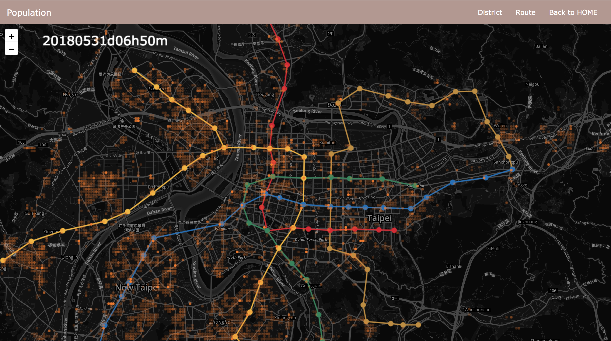
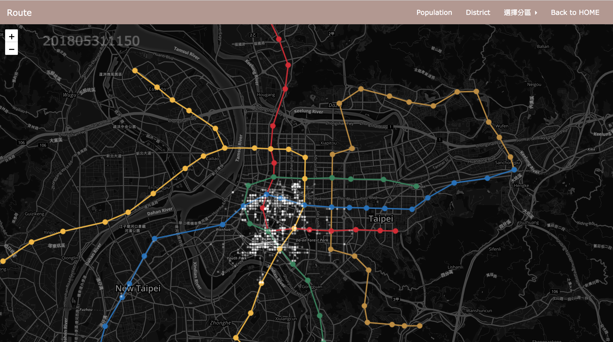

# Map_Visualization_frontend

In oder to visualize Big Data on web, the solution we figure out is draw on [Leaflet](https://leafletjs.com/) with [Canvas](https://developer.mozilla.org/en-US/docs/Web/API/Canvas_API)

This website is created in 2018.August.

- [Getting Started](#getting_started) 
- [Structure](#structure)
- [Example](#example)
- [Build yourself](#build_yourself)

## Getting_Started

> Because this project have no other dependency except one for drawing map (Leaflet), we just copy this to your web sever.

## Structure

    Map_Visualization_frontend/
        ├── index.html                  # stastic html file
        ├── L.CanvasLayer.js            # Leaflet Canvas template
        ├── myDistrictTWCanvas.js       
        ├── myMRTCanvas.js      
        ├── population/                 # web file for population
        ├── district/                   # web file for district
        ├── route/                      # web file for route
        └── img/                        # each website screenshot
        
## Example

### < Population />
    
> This will show North Taiwan population moving a day every ten minutes.
    



### < District />

> Because we use KD-tree to classify people in different district before, we want to check the result is correct or not.


### < Route />

> After classifying we can show different people in each district.



## Build_yourself

```javascript
    myCustomCanvasDraw= function(){
      this.onLayerDidMount = function (){      
         // -- prepare custom drawing    
      };
      this.onLayerWillUnmount  = function(){
         // -- custom cleanup    
      };
      this.setData = function (data){
        // -- custom data set
        this.needRedraw(); // -- call to drawLayer
      };
      this.onDrawLayer = function (viewInfo){
      // -- custom  draw
      }
      
    }
    
    myCustomCanvasDraw.prototype = new L.CanvasLayer(); // -- setup prototype 
    
    var myLayer = new myCustomCanvasDraw();
    myLayer.addTo(leafletMap);
```
Reference: [L.CanvasOverlay.js](https://gist.github.com/Sumbera/11114288)
